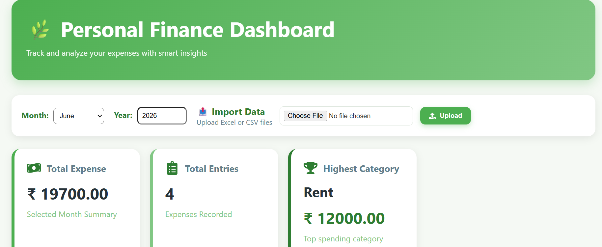
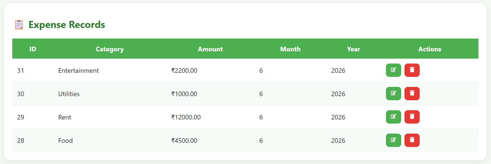

# 🌿 Personal Finance Dashboard

A full-stack expense management and analytics platform that helps users track, manage, and analyze their spending habits through interactive dashboards and visual insights.

## 🚀 Live Demo

Frontend: https://personal-finance-dashboard-flame.vercel.app

Backend API: https://personal-finance-dashboard-production-e41c.up.railway.app

---

## 📌 Features

### Expense Management

* Add Expenses
* Edit Expenses
* Delete Expenses
* Filter by Month and Year
* Category-wise Expense Tracking

### Analytics Dashboard

* Total Expenses Overview
* Total Entries Count
* Highest Spending Category
* Category-wise Expense Distribution
* Monthly Expense Trends
* Yearly Expense Analysis

### Data Import

* Import CSV Files
* Import Excel (.xlsx) Files
* Automated Bulk Expense Upload

### Cloud Deployment

* Frontend deployed on Vercel
* Backend deployed on Railway
* PostgreSQL database hosted on Supabase

---

## 🛠️ Tech Stack

### Frontend

* React.js
* Axios
* Recharts

### Backend

* Node.js
* Express.js

### Database

* PostgreSQL
* Supabase

### Deployment

* Vercel
* Railway

### Version Control

* Git
* GitHub

---

## 📸 Application Screenshots

### Dashboard Overview



### Expense Analytics


### Add Expense


### Expense Table



### Excel Import


---

## 📂 Project Structure

```bash
PersonalFinanceDashboard
│
├── frontend
│   ├── src
│   ├── components
│   ├── services
│   └── App.jsx
│
├── backend
│   ├── config
│   ├── routes
│   ├── controllers
│   ├── services
│   └── server.js
│
└── README.md
```

---

## ⚙️ Installation

### Clone Repository

```bash
git clone https://github.com/Prabin211/personal-finance-dashboard.git
```

### Frontend Setup

```bash
cd frontend
npm install
npm run dev
```

### Backend Setup

```bash
cd backend
npm install
npm start
```

---

## 📈 Future Enhancements

* User Authentication (JWT)
* Budget Planning Module
* PDF Report Export
* AI Expense Insights
* Email Notifications
* Dark Mode
* Multi-user Support

---

## 👨‍💻 Author

Prabin Dewan

GitHub: https://github.com/Prabin211

LinkedIn: Add your LinkedIn profile here
